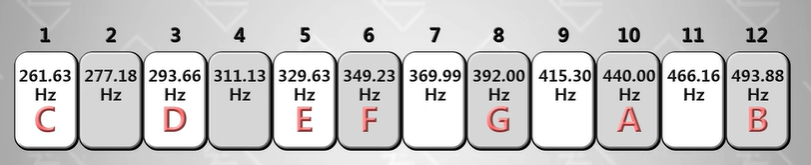

- [[Kanban]]
- [[3 vital things I decide to do]] #.ol
- [[3 good things I have done]] #.ol
- [[音乐/乐理]]
  deck::  #音乐/乐理
	- 什么是十二平均律? #card #bidirectional
	  id:: 65d86077-bbba-4fdf-8b46-21276a22ec9e
		- 一组由12个 {{cloze 间隔均等}} 的音组成的音律叫做12平均律。
		  id:: 65d860d2-c9a6-43d0-8b72-89922ced9172
		- 