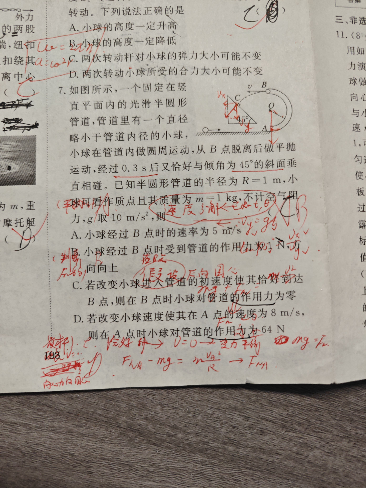
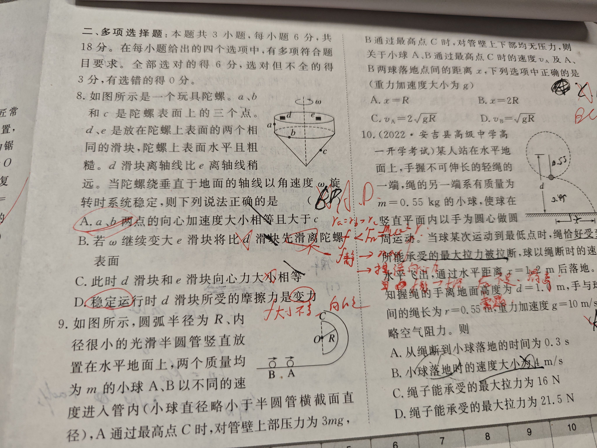
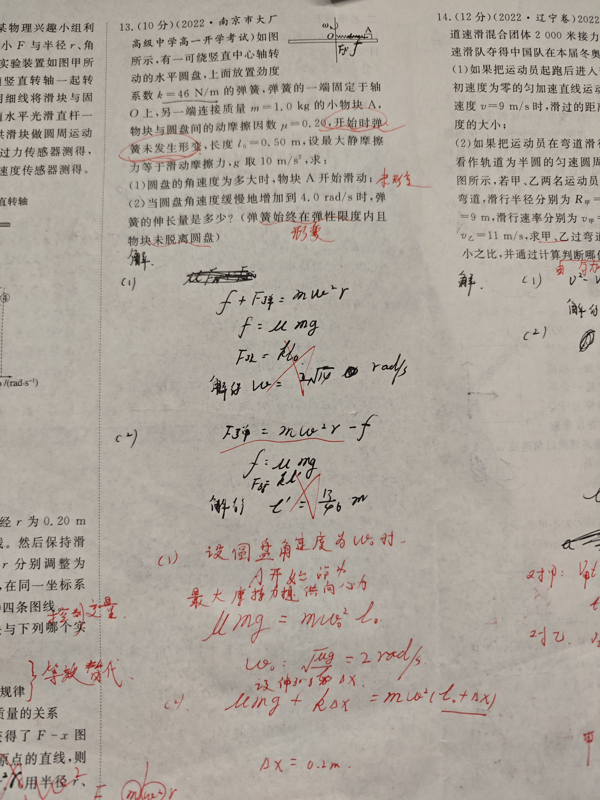
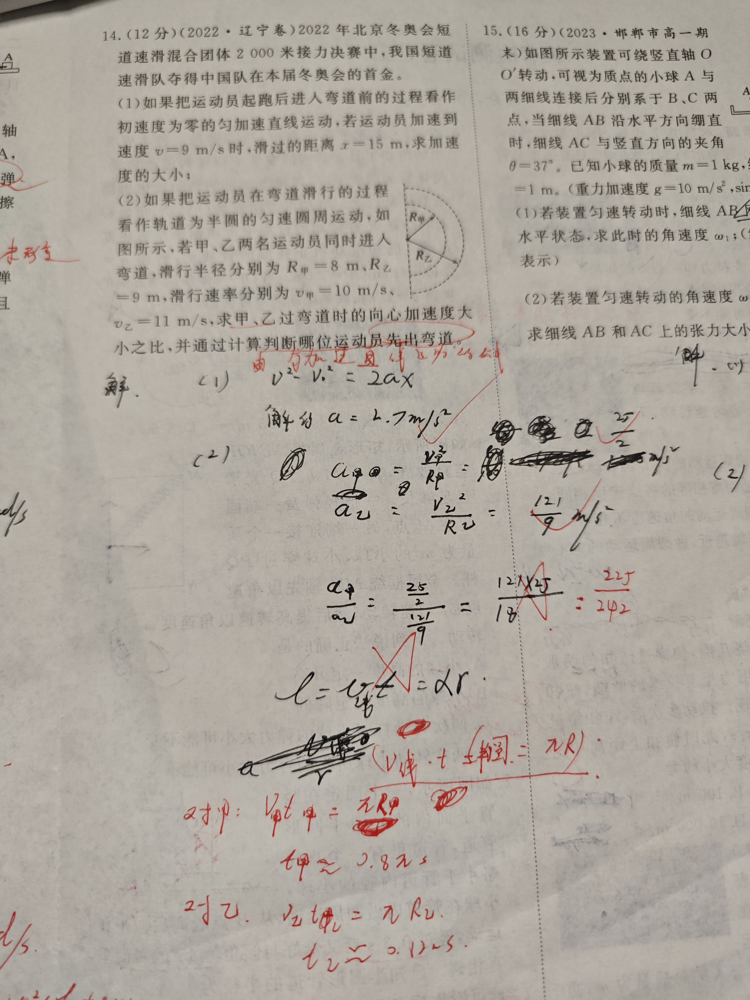
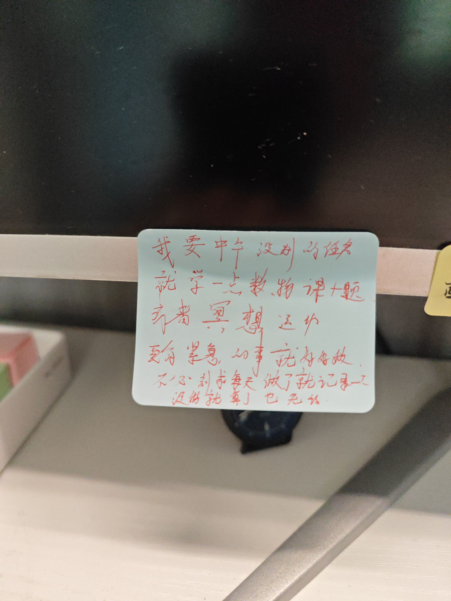
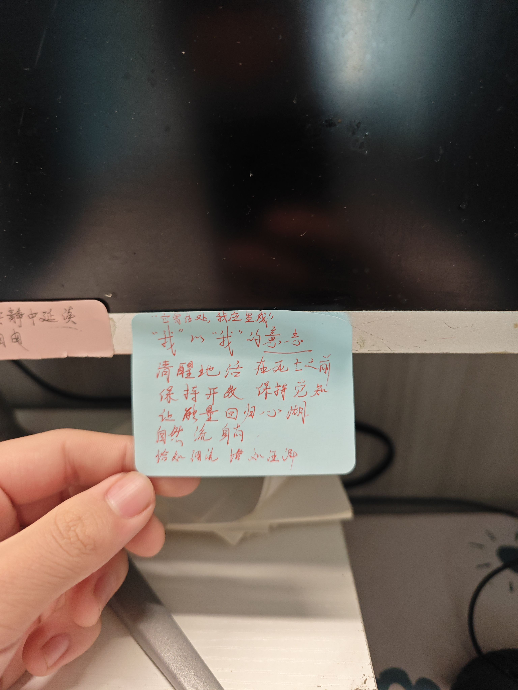
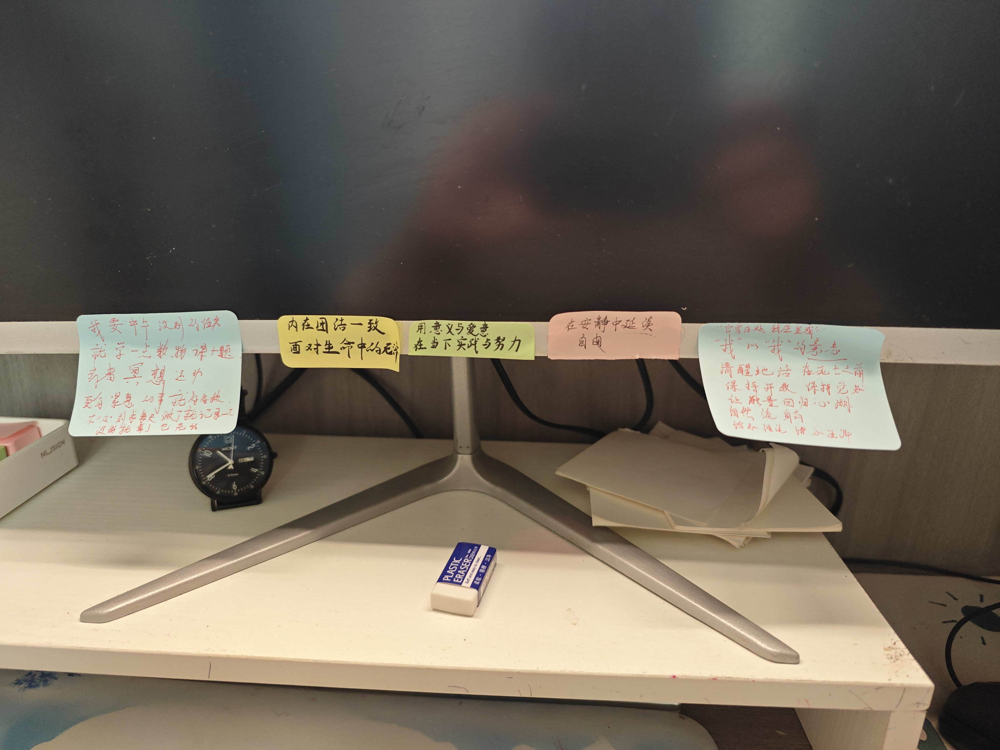

- #每日习题
	- deck:: #wl/circling
		- #card #wl/T/J2/2/7 #wl/T/J2/2/3 怎么联系到所学知识点？看到一个情景，它应该受什么样的力才合理？
		  collapsed:: true
			- 
		- #card #wl/T/J2/2/8 怎么理解滑离？
		  collapsed:: true
			- 
		- #card #wl/T/J2/2/13 弹簧拉东西的情景受力分析可能有几个力充当向心力？弹簧伸长后什么会变化？
		  collapsed:: true
			- 
		- #card #wl/T/J2/2/14 对于线速度的路程怎么理解？半圆的周长咋算？
		  collapsed:: true
			- 
		- #card #wl/T/B2/41/1 圆盘转速增大，什么决定它要滑走时的临界速度？
			- 向心力增加，静摩擦力跟着增大，静摩擦力达到最大值时$$kmg=m\omega^2r$$ 则 $$\omega = \sqrt{kg/r}$$，与 m 无关，这是对直觉的修正
- #DONELIST
	- #wl 复习了昨天的题
	- #life 修剪保养了花草
	- #spiritual 正念吃饭
	- #卮言 小感悟
	  collapsed:: true
		- 
		- 
		- 
	- #wl 认真地搞完了一套卷子
	- #wl 还搞了大册 认真的搞了两道题
	- 又认识了动态图像 验证体会 类比 讲道理 培养直觉 联系实际直觉
	- 又思考了匀速圆周运动的向心加速度
	- 规划了一下 先写新的大册 再写复习卷子 不要搞到晚上十一二点了 争取在五六点搞完作业
	- 生物通过看书自学了
	- 学了同分异构体 命名法 等效氢
	- 取了快递 清理了茶壶
	- 整理了冥想视频 加了练字视频 同步了音乐
	- 学到了鼠标和 quicker 的技巧
	- 生物又学了一个dna 复制与分裂间计算
	- 化学弄了一套卷子
	- 化学把小册认真搞了