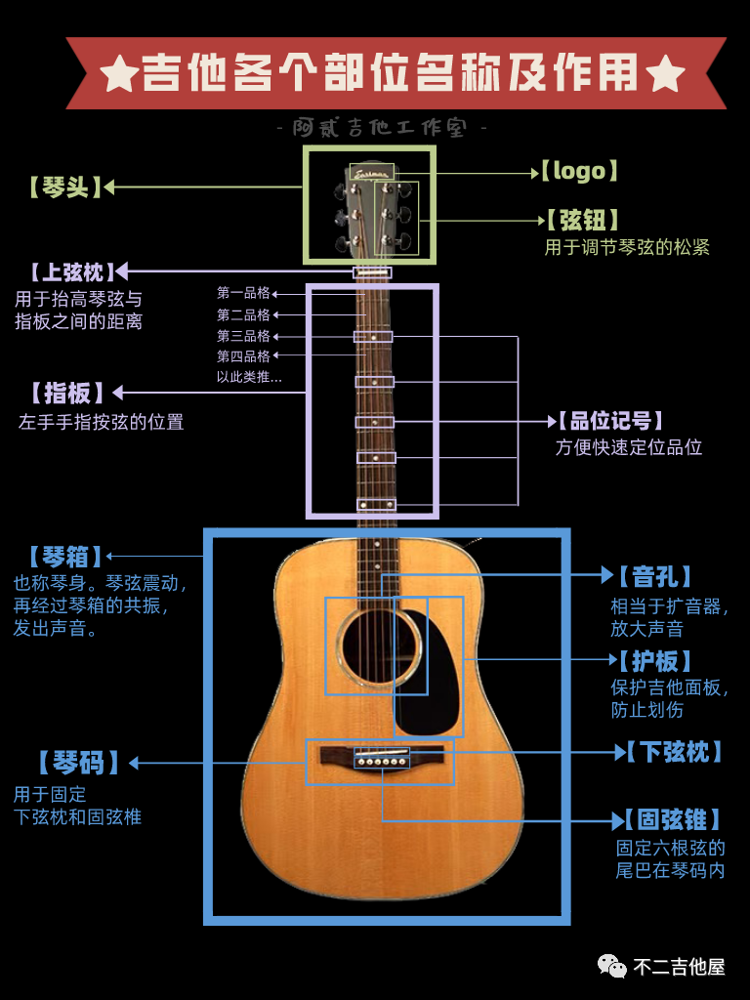

- > #冰镇葡萄糖乐队 内部吉他培训资料
- DONE 十二平均律 
  deck:: #乐理/十二平均律
  collapsed:: true
	- 什么是音阶和十二平均律? #card
	  id:: 668bd338-ab6a-4fe4-a25b-e5bf5b1136c6
	  collapsed:: true
		- 音阶就像是音乐中的“字母表”，由一组音符按照一定顺序排列组成。学习音阶可以帮助你更好地理解和演奏音乐
		- 十二平均律是一种将一个八度音阶平分为十二个等分的音律体系，每个音之间的频率比是相等的
	- 两者之间的关系? #card
	  id:: 668c7e23-b200-44e0-a211-7eb410444e17
	  collapsed:: true
		- 1.  **音高的确定**：十二平均律将八度内的音高分为12个相等的音程，每个音程称为一个半音。在钢琴上，十二平均律的每个键（包括黑键和白键）都是一个半音。
		- 2.  **音阶的构建**：音阶是由一系列音高按照特定模式排列组成的，而这些音高都是从十二平均律的12个音中选择的。
			- 例如，大调音阶和小调音阶都是从十二平均律的音中选择的音高，并按照特定的全音和半音模式排列。
		- 3. e.g. **C大调音阶（在十二平均律中的构建）**: 从十二平均律的音中选择起始音“C”, 按照大调音阶的模式（全音 - 全音 - 半音 - 全音 - 全音 - 全音 - 半音），从C开始构建音阶：
	- C, D, E ... B | do, re, mi, ..., si | 1, 2, 3, 4, ...7 的分别是什么? 他们之间的关系是什么? #card
	  id:: 668bcd29-6a04-4a03-9621-ceb29d277dbf
	  collapsed:: true
		- C, D, E, F, G, A, B是七个自然音符；do, re, mi, fa, sol, la, si是音阶中的唱名；1, 2, 3, 4, 5, 6, 7是简谱记号。它们代表同一组音，但用不同的系统来表示
	- C1, C2, C3, ... 的关系是什么? 与 C, D, E, ... 有什么区别 #card
	  id:: 668bcd94-f578-4eac-a2a2-b4ad81dee377
	  collapsed:: true
		- C1, C2, C3代表不同八度的C音，比如C1是低音C，C2是中音C，C3是高音C。C, D, E, ... 只是单个音符，不区分八度
	- 十二平均律 C ~ B 之间每个音的跨度是什么? #card
	  id:: 668bcdca-fe0e-4c25-8060-6cdd680e07a5
	  collapsed:: true
		- C, D, E, F, G, A, B 全全半全全全半
	- 两个全音之间, 如 C, D 之间的音可称为什么? #card
	  id:: 668bd276-076c-4bb5-bf8a-3d029880db2a
	  collapsed:: true
		- C# 或 Db (升 C 或 降 B)
		- C (C# / Db) D 之间每个都差一个半音
- DONE 认识吉他
  deck:: #吉他/结构
  collapsed:: true
	- 吉他上的各个部位的部件分别叫什么? #card
	  id:: 668bcdf1-d01c-4049-8e81-d6c859425a51
		- 
	- 调弦时如果音高了, 一二三, 四五六, 两组弦分别应该怎么调? #card
	  id:: 668bce02-fc00-4b14-8731-253202bd6ccf
		- 要把弦调松: 一二三往外, 四五六往里
	- 吉他的品位标记有什么用? #card
	  id:: 668bcf47-e351-4eb0-8aa8-c8dbf7faa922
		- 泛音 / 计数
- DONE 常见的两种吉他分类
  deck:: #吉他/分类
  collapsed:: true
	- 木吉他与电吉他有什么区别? #card
	  id:: 668bcf87-f1ad-4c91-971e-5e99e0012c62
		- **声音产生方式**：
			- **木吉他**：声音是通过琴弦振动传递到琴体，琴体的共鸣箱放大声音。因此，它不需要外部设备来发出声音。
			- **电吉他**：声音是通过琴弦的振动产生电信号，然后通过拾音器传输到放大器。没有放大器，电吉他几乎无法发出声音。
		- **结构和设计**：
			- **木吉他**：通常有一个空心的共鸣箱，这个共鸣箱放大琴弦的振动。木吉他有钢弦和尼龙弦两种，前者通常用于民谣、乡村和流行音乐，后者则多用于古典和弗拉门戈音乐。
			- **电吉他**：通常是实心的，虽然也有半空心和全空心的设计。电吉他的琴身通常比木吉他更薄更重，并且有各种形状和设计。
		- **音效和风格**：
			- **木吉他**：适合演奏不需要外部效果的音乐，如民谣、蓝调、古典和一些流行音乐。它的声音自然、温暖。
			- **电吉他**：适合演奏需要各种音效和失真效果的音乐，如摇滚、金属、爵士和流行音乐。通过效果器和放大器，电吉他可以产生多种不同的音色和效果。
		- **演奏技巧**：
			- **木吉他**：通常注重指法和手指力度的控制，适合弹唱和指弹。
			- **电吉他**：由于电信号的放大，演奏时对力量的要求较低，适合快速的演奏和各种技巧（如推弦、颤音、滑音、拍弦等）。
		- **配件和设备**：
			- **木吉他**：通常不需要额外的设备，最多可能需要一个调音器和变调夹。
			- **电吉他**：通常需要放大器、效果器、连接线等设备，以便产生和调节各种音效。
- DONE 吉他购买方式
  deck:: #吉他/购买
  collapsed:: true
	- 常见的购买渠道? #card
	  id:: 668bcfa8-9a78-4a3b-ba15-44fdac076fea
		- 琴行 (价格溢价,容易坑初学者, 捆绑吉他课 | 品质可能更好, 可以当场体验和调试)
		- 官方网店(推荐): 淘宝/京东/拼多多/知名UP 主的平台店 (价格适中, 服务较好)
		- 个人网店: 闲鱼 (价格低, 可能有暗伤)
		- 租赁 / 租借 (可体验好琴, 短期划算 | 长期不划算, 手续麻烦)
	- 常见的价位? #card
	  id:: 668bcfc1-803a-4b8e-825d-7e6be8827654
		- 大约 200 以下: 大概率有各种问题 "烧火棍"
		- 200~500: 可能好可能坏
		- 500 ~ 1500: 入门, 质量稳定
		- 1500 ~ 6000: 进阶学习
		- 6000 ~ 10000: 专业演奏
		- 10000+ 更多的只是附加价值, 音色差距很小
- DONE 学术交流与团建活动
- DONE #乐理 六线谱与简谱
- DONE #吉他/分类 其他类型的吉他/类吉他的进一步介绍
- DONE #吉他/分类 不同的演奏风格
- DONE #吉他/练习 持琴姿势: 坐姿与站姿
- DONE #吉他/练习 右手拨弦方法
- DONE #吉他/结构 换弦
- DONE #吉他/结构 调音
- DONE #乐理 和弦入门1
- DONE #吉他/练习 左手按弦方法+和弦按弦方法
- DONE #吉他/练习 爬格子
- DONE #吉他/乐理 #吉他/练习 C 大调音阶
- DONE #乐理 音符时值与节拍
- DONE #吉他/指弹 左右手配合: 爱的罗曼史
  :LOGBOOK:
  CLOCK: [2024-08-04 Sun 20:34:49]
  :END:
- ## 团建活动策划
  collapsed:: true
	- ### 正坐定禅练习
		- 介绍
			- 源自中国古代武术和瑜伽修炼的结合体。它通过整合正确的姿势、呼吸和体位来训练身体和精神。这种练习有着悠久的历史渊源，可以追溯到中国古代道家哲学中的"静坐功"，同时也受到印度瑜伽术和佛教禅修的影响。通过中华正坐练习，可以实现身心双重融合，培养正确的姿势、呼吸和体位，从而改善姿势问题，提高精力和集中力，并对身体健康产生积极的影响。
	- ### 正念静心练习
		- 介绍
			- 源自印度佛教禅修技术，通过静坐和观察自己的思维来培养专注、平等和宽容的精神状态。这项练习强调在当下时刻放下的杂念，专注于身体感觉、感知和体验。这种练习可以减少压力、提高情绪稳定性和睡眠质量，并增强自我认知能力。
	- ### 友爱慈心练习
		- 介绍
			- 融合了中国古代佛教慈悲修行和西方的心理治疗技巧，通过共同呼吸和祷告来培养对所有人的同情和理解。这项练习可以提高团队凝聚力、人际关系和社会责任感，并增强共情能力和宽容度。
- 技能
	- 摇滚手型 lv 1. (电吉他 / 乐队伴奏 进阶前置技能)
	- 古典手型 lv 1. (民谣吉他/古典吉他/Flamenco 进阶前置技能)
- 转职
	- 指弹(只弹, finger-style)
		- 练习: 倔强青铜
			- [清白之年前奏小曲](http://192.168.100.1:8083/read/26/pdf)
			  id:: 66af76a6-7dd3-4741-bb64-23fc955acbae
		- 练习: 秩序白银
		  collapsed:: true
			- 平凡之路节奏型加花版(两种分解和弦, 初级打板, 初级轮指与琶音, 拍扫, 强弱规律)
	- 弹唱
		- 练习: 倔强青铜 平凡之路
			- 和弦转换
			- 扫弦
			- #声乐/练习 C 大调音准
		- 练习: 秩序白银 成都
			- 击弦
			- 勾弦
		- [史上最详细吉他扫弦【扫好听】系列教学/慢学吉他 十二_哔哩哔哩_bilibili](https://www.bilibili.com/video/BV12M4y1G7tT/)
- #声乐/练习 mi-ma
- #吉他/弹唱 弹唱结合: Frère Jacques
  :LOGBOOK:
  CLOCK: [2024-08-17 Sat 21:18:02]
  :END:
- #吉他/练习 扫弦节奏型
- #吉他/练习 常见非横按和弦
- #吉他/练习 和弦转换
- #吉他/技巧 丝滑演奏
- #吉他/技巧 琶音
- #吉他/技巧 揉弦
- #吉他/技巧 切音
- #吉他/技巧 拍弦
- #吉他/技巧 打板
- #吉他/技巧 泛音
- #吉他/结构 特殊调弦
- #吉他/指弹 指弹入门: 少年的梦(特殊调弦) / always with me(标准调弦)/其他梁爽喜欢的
- #吉他/弹唱 弹唱入门: 成都/其他梁爽喜欢的
- ## References
	- #Ups #资源 #音乐 #吉他 [胡sir](https://space.bilibili.com/304503285?spm_id_from=333.337.search-card.all.click)
	- #Ups #资源 #音乐 #吉他  [大吉霸](https://space.bilibili.com/87918598?spm_id_from=..0.0)
	- #Ups #资源 #音乐 #吉他  [大树音乐屋](https://space.bilibili.com/258556829)
	- #Ups #资源 #音乐 #吉他  [元子弹吉他](https://space.bilibili.com/326251291?spm_id_from=..0.0)
	- ((57f0b674-ed7d-4b80-bf4c-45caf91002e3))
	- ((6665bf5c-6f7b-4c0d-89cf-a75df89f8002))
	- #Ups #资源 #音乐 #吉他 [伍伯伯的吉他铺](https://space.bilibili.com/47386415/)
	- #Ups #资源 #音乐 #吉他  [革命吉他](https://space.bilibili.com/95338079/)
	- #Ups #资源 #音乐 #吉他 #资讯 [吉他情报局](https://space.bilibili.com/103600069/)
	- #Ups #资源 #音乐 #吉他 #资讯 [吉他社](https://space.bilibili.com/7932981/)
	- #Ups #资源 #音乐 #吉他 #编曲 [MingY](https://space.bilibili.com/267397200/video)