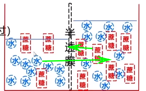

- [【一生】细胞膜及物质的运输“一锅端”！_哔哩哔哩_bilibili](https://www.bilibili.com/video/av336712078/) #biology
- 渗透作用 #S
	- 方向(e.g. 红细胞在清水中吸水膨胀, 高浓度溶液中失水皱缩)
		- 
		- (同时发生, 整体方向)
		- 水: 水多==> 水少
		- 溶液: 低浓度 ==> 高浓度
	- 条件
		- 半透膜: 仅允许溶剂分子, 不允许溶质分子
			- 半透膜两侧溶液存在渗透差
			  id:: 6634e692-c889-484a-aa2e-80d71ee0bda3
- 细胞膜
	- 结构特性: 流动性
	- 功能特性: 选择透过性
- 被动运输: 顺浓度梯度
	- *水大部分自由扩散, 小部分协助扩散*
	- 自由扩散
		- 气体: $\ce{CO2, O2}$
		- 脂溶性小分子: 甘油, 乙醇, 苯
	- 协助扩散
		- 需要: 载体蛋白/通道蛋白
		- 实例: **葡萄糖进入红细胞, 葡萄糖进入肌细胞**
- 主动运输: 逆浓度梯度, 需要能量
	- 需要: 载体蛋白
	- 实例: 葡萄糖, 氨基酸, 无机盐
- 胞吞胞吐: 需要能量
	- 实例: 大分子物质, 颗粒性物质(神经递质)
	- note
		- 跨过了 **0** 层膜